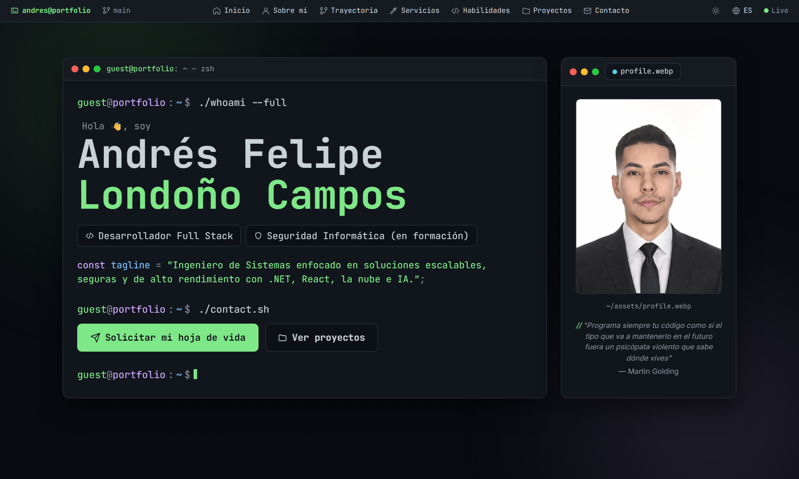
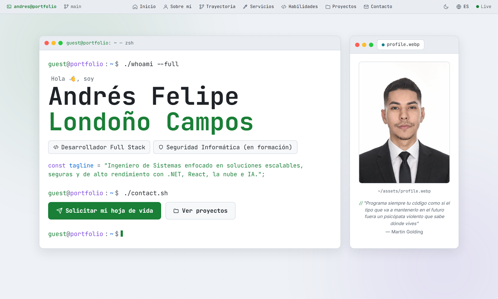

# 💻 Portafolio de Andrés Felipe Londoño Campos

**Ingeniero de Sistemas** · Desarrollador **Full Stack** (.NET, React, Node) · cursando **Especialización en Seguridad Informática**.

Soy una persona autodidacta, enfocada en construir soluciones **escalables, seguras y de alto rendimiento**. Trabajo a diario con arquitecturas de microservicios, bases de datos, la nube e integraciones de IA. Este es mi portafolio personal: un espacio para mostrar mi experiencia, mis proyectos y la tecnología con la que trabajo.

🔗 **Sitio en vivo:** [apidriuc.github.io/Developer-Portfolio](https://apidriuc.github.io/Developer-Portfolio/)
📧 **andresfloncam@gmail.com** · 🐙 [github.com/ApidriuC](https://github.com/ApidriuC)

<em>Tema «DevOS» — modo oscuro (arriba) y modo claro (abajo).</em>

---

## 🪟 El concepto: «DevOS»

El portafolio está diseñado como un **editor de código / terminal**: cada sección es una "ventana" distinta, fiel a mi día a día como desarrollador.

| Sección | Cómo se presenta |
|---|---|
| 🏠 Inicio | Una **terminal** con animación de escritura (`./whoami --full`) |
| 📊 Métricas | Salida de `npm run build` con contadores |
| 👤 Sobre mí | Un archivo **`README.md`** renderizado |
| 🌿 Trayectoria | Un **`git log`** con mi experiencia como commits |
| 🧠 Servicios | Tarjetas tipo **`function()`** |
| 📦 Stack | Un **`stack.json`** con *syntax highlighting* |
| 📁 Proyectos | Tarjetas tipo **repositorio de GitHub** |
| 📬 Contacto | Una **terminal** con comandos |

Además: **bilingüe Español/Inglés**, **modo claro y oscuro** (ambos persistentes) y diseño responsive.

---

## 👨‍💻 Sobre mí

Graduado de **Ingeniería de Sistemas e Informática** (Universidad Pontificia Bolivariana, Bucaramanga – Colombia). Me especializo en desarrollo Full Stack con **.NET y React/TypeScript**, APIs y microservicios, gestión de bases de datos (**SQL Server, Oracle**) y despliegue en la nube (**AWS, Azure**). También tengo experiencia en integración de **IA, OCR y automatización**.

Actualmente estoy fortaleciendo mi perfil hacia el **desarrollo seguro**, cursando una Especialización en Seguridad Informática y la certificación AWS Certified Cloud Practitioner.

---

## 🌿 Trayectoria

| Periodo | Rol | Empresa |
|---|---|---|
| **2025 – Actual** | Desarrollador de Software Full Stack | I.A.S Software |
| **2022 – 2025** | Desarrollador de Software Full Stack | Sistemas y Computadores S.A. |
| **2022** | Practicante Desarrollador de Software | Sistemas y Computadores S.A. |

---

## 🎓 Formación

- 🛡️ **Especialización en Seguridad Informática** — Universidad Pontificia Bolivariana · *en curso*
- ☁️ **AWS Certified Cloud Practitioner** — Amazon Web Services · *en curso*
- 🎓 **Ingeniero de Sistemas e Informática** — Universidad Pontificia Bolivariana · 2023
- 🏅 **Certificación Misión TIC 2022** — Universidad Industrial de Santander · 2023
- 🏅 **Certificación VERACODE** (seguridad de aplicaciones) · 2023
- ✨ **1er Congreso Internacional de Ingeniería** — UPB · 2021

---

## 🧰 Stack

- **Front-End:** React · Angular · Next.js · TypeScript · JavaScript · jQuery · HTML · CSS · Bootstrap · Tailwind
- **Back-End:** Node.js · NestJS · .NET · C# · Java · Python · Docker
- **Bases de datos:** SQL Server · Oracle · MySQL · PostgreSQL
- **Cloud:** AWS · Azure
- **Herramientas:** Git · Visual Studio Code · Visual Studio 2022

---

## 📁 Proyectos destacados

| Proyecto | Descripción | Enlace |
|---|---|---|
| **EDESK Prisma** | Plataforma de centralización del servicio al cliente para contribuyentes en Colombia: impuestos y trámites. | [Demo](https://edeskprisma.syc.com.co/NoClient.html) |
| **Stream For Labs** | Sistema distribuido para administrar, sincronizar y compartir archivos, fotos y video, con galería y streaming. | [Repo](https://github.com/IngDeiver/streams-for-labs-web-client) |
| **SyCaptcha** | Captcha propio para detectar interacciones automatizadas o maliciosas. | [Repo](https://github.com/ApidriuC/SyCaptcha.Client) |
| **MercAnalyzer** | Web scraping para análisis y comparación de precios del mercado. | [Repo](https://github.com/ApidriuC/MercAnalyzer.Client) |
| **Dispensador – Casa Libro Total** | Módulo de registro y dispensación de recursos. | — |
| **Bingo** | Algoritmo en Java para la generación de cartones de bingo. | [Repo](https://github.com/ApidriuC/Bingo_Alcaldia_Risaralda) |

> 🔒 Una parte importante de mi trabajo está en **proyectos privados o confidenciales** (de clientes y empresa) que no pueden exhibirse públicamente; en esos casos mi aporte queda reflejado como contribución a soluciones internas.

---

## 🛠️ Hecho con

  
  
  
  
  
  

---

## 📬 Contacto

¿Tienes un proyecto, una oportunidad o simplemente quieres saludar?

- 📧 **andresfloncam@gmail.com**
- 🐙 [github.com/ApidriuC](https://github.com/ApidriuC)
- 💼 [LinkedIn](https://www.linkedin.com/in/andr%C3%A9s-felipe-londo%C3%B1o-campos-b03741222/)
- 🌐 [Sitio en vivo](https://apidriuc.github.io/Developer-Portfolio/)

© Andrés Felipe Londoño Campos · Proyecto personal — textos, imágenes y datos son de mi autoría.

